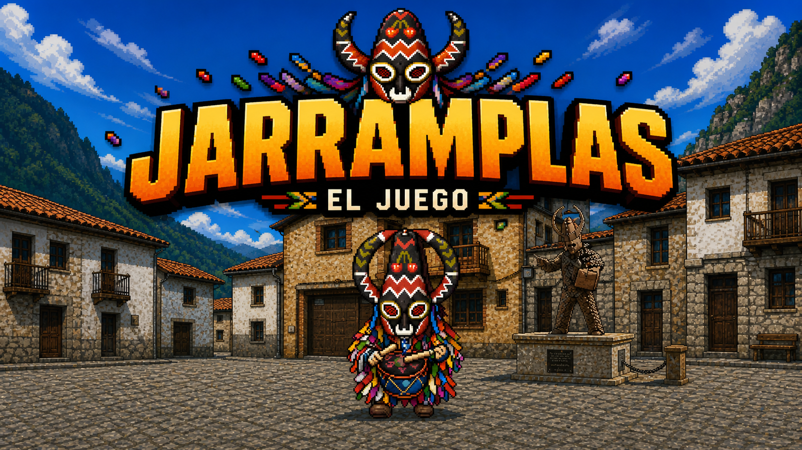

# 🎯 Jarramplas - El Juego


> Juego arcade web inspirado en la fiesta tradicional de Jarramplas (Piornal, Extremadura).

---

## 🕹️ Demo

👉 https://jarramplas.alon.one/

---

## 📸 Capturas



---

## 🚀 Características

- 🎯 Gameplay arcade rápido y adictivo
- 📱 Optimizado para móvil (touch)
- 🎮 Varios modos de juego
- 🏆 Sistema de récords
- 📊 Estadísticas persistentes
- 🔥 Sharing viral integrado
- 🌍 Preparado para leaderboard global

---

## 🧠 Cómo jugar

1. Pulsa **Jugar**
2. Elige modo
3. Selecciona nivel
4. Arrastra y lanza el nabo
5. Golpea a Jarramplas y evita a la gente

---

## ⚙️ Tecnologías

- HTML5 Canvas
- JavaScript Vanilla
- LocalStorage
- Firebase (opcional leaderboard)

---

## 📁 Estructura

```
index.html
styles.css
game.js
config.js
storage.js
assets/
```

---

## 🚀 Desarrollo

```bash
python3 -m http.server
```

---

## 🧭 Roadmap

- [x] Juego base
- [x] Sharing viral
- [x] Leaderboard local
- [ ] Leaderboard global
- [ ] Sistema de combos
- [ ] Misiones diarias
- [ ] PWA

---

## 💡 Ideas futuras

- 🎮 Modo frenesí
- 🧠 IA de movimiento
- 🔊 Sonido y música
- 👥 Retos entre amigos

---

## 👤 Autor

Jorge Alonso

---

## ❤️ Inspiración

Basado en la fiesta tradicional de Jarramplas en Piornal.
